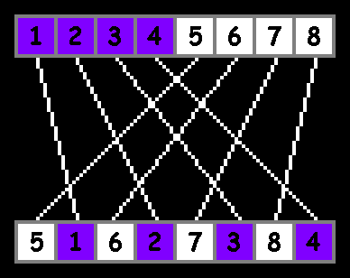
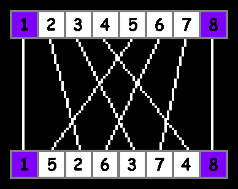
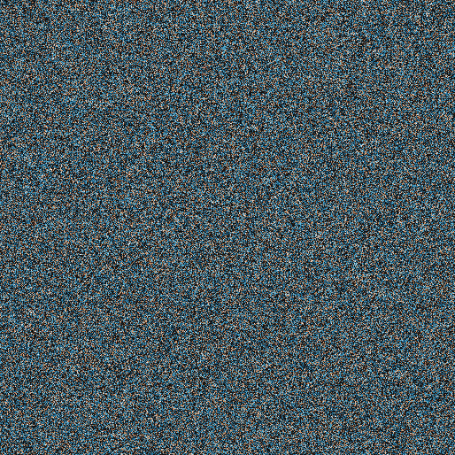
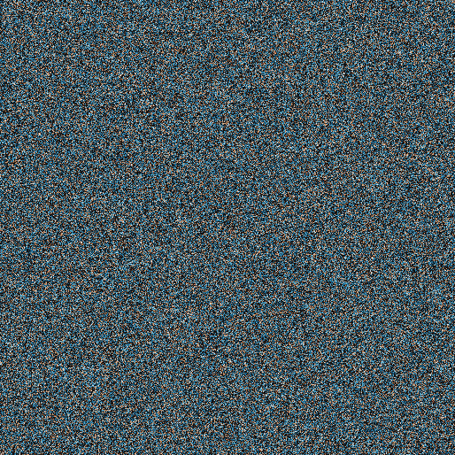

# Perfect Shuffle Cryptography

Welcome to **Perfect Shuffle Cryptography**, a lightweight and elegant encryption tool that uses a [deterministic perfect shuffle algorithm](https://github.com/xcontcom/perfect-shuffle/blob/main/docs/article.md) to secure data. Featuring the spirit of Reefer, the chonky cat, this project provides two implementations: a file-based encryption tool (`shuffle_file.js`) for securing files like images, and a text-based demo (`shuffle_text.html`) for interactive exploration. Whether you're David sending encrypted cat pics to Jimmy or just curious about permutation-based cryptography, this project has you covered!

---

## What is a Perfect Shuffle?

A **perfect shuffle** is a permutation technique where a sequence (like a deck of cards or a string of bits) is split into two equal halves and interleaved in a specific order. This project uses two types of perfect shuffles to encrypt and decrypt data:

- **In-Shuffle**: The second half of the sequence is interleaved with the first half, starting with the second half. For a sequence `[1, 2, 3, 4, 5, 6, 7, 8]` (split into `[1, 2, 3, 4]` and `[5, 6, 7, 8]`), an in-shuffle produces `[5, 1, 6, 2, 7, 3, 8, 4]`.



- **Out-Shuffle**: The first half of the sequence is interleaved with the second half, starting with the first half. For `[1, 2, 3, 4, 5, 6, 7, 8]`, an out-shuffle produces `[1, 5, 2, 6, 3, 7, 4, 8]`.



The sequence of in-shuffles (represented by `1`) and out-shuffles (represented by `0`) is determined by a binary key. For example, a key of `101` means: in-shuffle, out-shuffle, in-shuffle. This deterministic shuffling obscures the data, making it secure without the key.

---

## How It Works

### File-Based Encryption (`shuffle_file.js`)


The `shuffle_file.js` script encrypts and decrypts files using the perfect shuffle algorithm. It’s designed for scenarios like encrypting a PNG file (`reefer.png`) and sharing it securely.

---

#### Encryption (Shuffle)
- Reads an input file (e.g., `reefer.png`) and converts it to a binary string.
- Generates a random binary key (`newkey.txt`) and prepends it to the binary string.
- Applies a sequence of in-shuffles and out-shuffles based on an existing key (`oldkey.txt`).
- Saves the shuffled result as a data file (`reefer.data`).
- Outputs the new key for future use.

---

#### Decryption (Unshuffle)
- Reads the shuffled data file (`reefer.data`) and converts it to a binary string.
- Reverses the shuffle sequence using `oldkey.txt` (in reverse order).
- Splits the unshuffled binary string into the new key and the original file data.
- Saves the original file (`reefer.png`) and the new key (`newkey.txt`).

---

#### Hypothetical Scenario: David and Jimmy
- **David** wants to send a picture of his chonky cat, Reefer (`reefer.png`), to **Jimmy**.
- David runs `node shuffle_file.js shuffle` with `oldkey.txt`, producing `reefer.data` and `newkey.txt`.
- David sends `reefer.data` to Jimmy and keeps `newkey.txt` for the next shuffle. He can delete `oldkey.txt`.
- Jimmy receives `reefer.data` and runs `node shuffle_file.js unshuffle` with his copy of `oldkey.txt`.
- Jimmy recovers `reefer.png` and gets `newkey.txt` for the next round. He can delete `oldkey.txt`.
- Without `oldkey.txt`, an attacker with `reefer.data` cannot decrypt it or recover the new key, keeping Reefer’s glory secure!

---

### Forward Secrecy
Because each message includes a freshly generated key, and you never reuse keys, this system provides forward secrecy: if an adversary obtains any future key, they cannot decrypt prior messages. Compromising one key only exposes the next messages, not past ones.

---

### PNG Pixels Shuffle (`shuffle_png.js`)

In addition to `shuffle_file.js`, which encrypts files by treating their binary data as a single bitstream, this project also includes `shuffle_png.js`. This script demonstrates a **spatial shuffle** of PNG image pixels, rather than raw bytes. 

**Why a separate approach?**

- The file-based shuffler (`shuffle_file.js`) operates at the byte level, which is format-agnostic but can break compression and headers, making files unreadable until fully unshuffled.
- `shuffle_png.js` decodes the PNG into a 2D pixel array, recursively shuffles pixel positions, and re-encodes the image. This allows you to *see the effect visually* - the shuffled image still opens as a valid PNG, but appears scrambled.
- It is useful for demonstration, educational purposes, or lightweight obfuscation where format integrity must be preserved.

Below is an example of this process applied to a sample image:

| Original Image | Shuffled Image | Wrong Key Attempt |
|---|---|---|
|  |  |  |

[online demo](https://xcont.com/shuffle_text/shuffle_png_web_modes.html)

---

### Text-Based Demo (`shuffle_text.html`)

For an interactive experience, try the [online demo](https://xcont.com/shuffle_text/shuffle_text.html). The `shuffle_text.js` script powers a web-based tool that shuffles and unshuffles text sequences, demonstrating the algorithm in action.

---

#### How the Demo Works
- **Input**: Enter a text sequence (e.g., `HelloWorld`) in the "Original Sequence" field.
- **Mode**: Select "Shuffle" to encrypt or "Unshuffle" to decrypt.
- **Key**: For shuffling, a random 20-bit key is generated and displayed. For unshuffling, paste a binary key (e.g., `101010...`).
- **Process**:
  - **Shuffle**: The input text is converted to an array of characters, padded with a space if needed (to ensure even length). The algorithm applies in-shuffles or out-shuffles based on the key, displaying the shuffled result. It also verifies correctness by unshuffling the result to recover the original text.
  - **Unshuffle**: The input text (previously shuffled) is unshuffled using the provided key, displaying the original text. It verifies by re-shuffling to confirm the process.
- **Output**: See the processed sequence and the reversed sequence to confirm the algorithm’s reversibility.

Try it out to see how `HelloWorld` transforms into a scrambled mess and back again, all thanks to the power of perfect shuffles!

---

## Getting Started

### Prerequisites
- **For `shuffle_file.js`**:
  - Node.js (for file I/O operations).
  - Input files: `oldkey.txt` (binary key, e.g., `101010...`), `reefer.png` (or any file to encrypt).
- **For `shuffle_text.html`**:
  - A modern web browser (no additional setup needed).

---

### Installation
1. Clone the repository:
   ```bash
   git clone https://github.com/xcontcom/perfect-shuffle-cryptography.git
   cd perfect-shuffle-cryptography
   ```
2. For `shuffle_file.js`, ensure Node.js is installed:
   ```bash
   npm install
   ```
   (No dependencies are required beyond Node.js’s built-in `fs` module.)

---

### Usage
- **File Encryption/Decryption**:
  - Encrypt a file:
    ```bash
    node shuffle_file.js shuffle
    ```
    Inputs: `reefer.png`, `oldkey.txt`
    Outputs: `reefer.data`, `newkey.txt`
  - Decrypt a file:
    ```bash
    node shuffle_file.js unshuffle
    ```
    Inputs: `reefer.data`, `oldkey.txt`
    Outputs: `reefer.png`, `newkey.txt`
- **Text Demo**:
  - Open `shuffle_text.html` in a browser or visit [https://xcont.com/shuffle_text/shuffle_text.html](https://xcont.com/shuffle_text/shuffle_text.html).
  - Enter a sequence, select a mode, and click "Process" to see the shuffle in action.

---

### Security Notes
- **Key Length**: Longer keys (e.g., 128+ bits) significantly increase security by expanding the number of possible shuffle sequences (\(2^n\) for an \(n\)-bit key).
- **Key Secrecy**: `oldkey.txt` must be shared securely between parties (e.g., via a trusted channel).
- **Limitations**: This is a permutation-based cipher, not as robust as modern standards like AES. Use it for fun, lightweight encryption (like cat pics), not to secure nuclear launch codes.
- **Known-Plaintext Risk**: If an attacker has both the original and shuffled data, they could deduce the key. Use long keys and avoid predictable data patterns.

---

## Contributing
Want to make this even more badass? Contributions are welcome! Fork the repository, make your changes, and submit a pull request. Ideas:
- Optimize the shuffle algorithm for larger files.
- Add a key derivation function for secure key generation.
- Enhance the web demo with visualizations of the shuffle process.

---

## License

MIT License. See [LICENSE](LICENSE) for details.

---

## Author

Serhii Herasymov  

sergeygerasimofff@gmail.com  

https://github.com/xcontcom

---

## Acknowledgments
- Inspired by the cryptographic elegance of perfect shuffles and the chonky charm of Reefer the cat.
- Thanks to David and Jimmy for their hypothetical cat-pic-sharing adventures!
